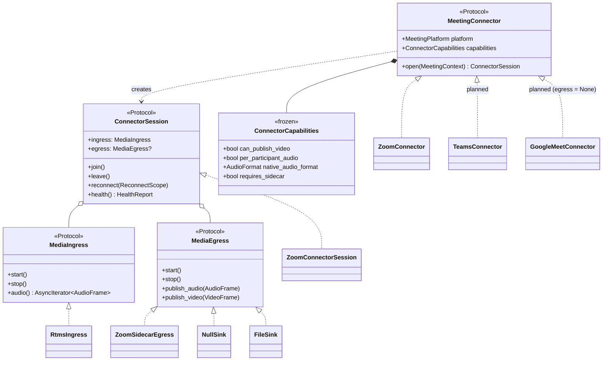
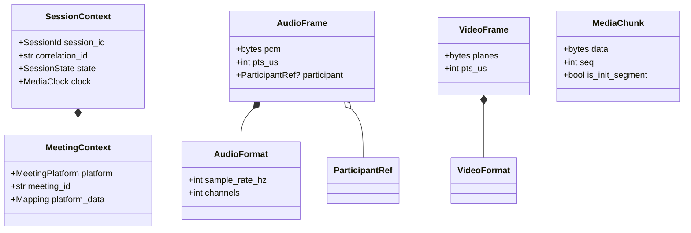
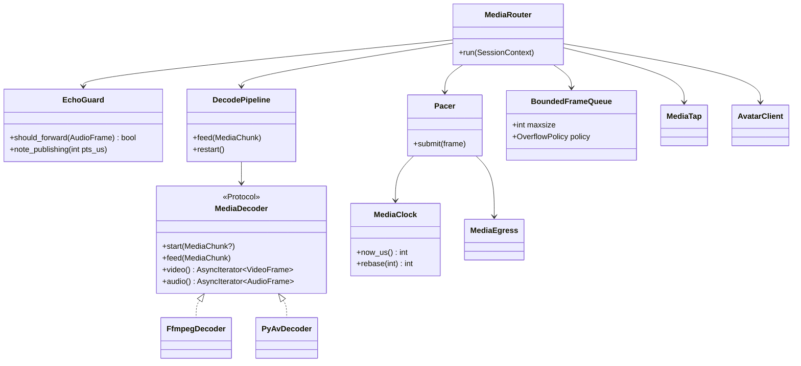
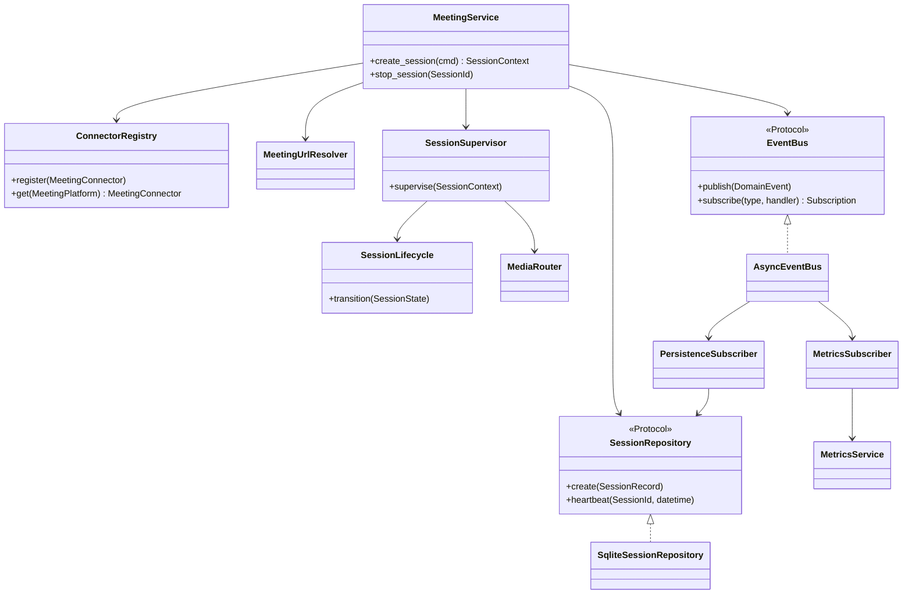
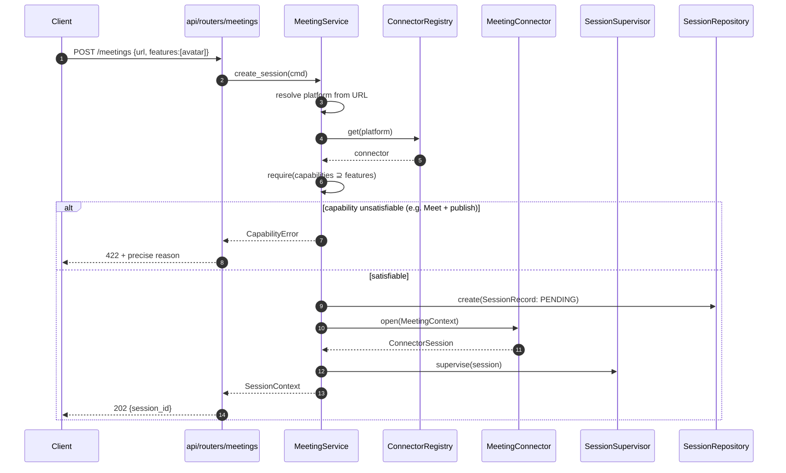
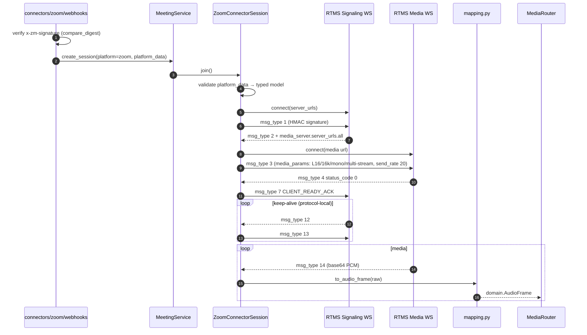
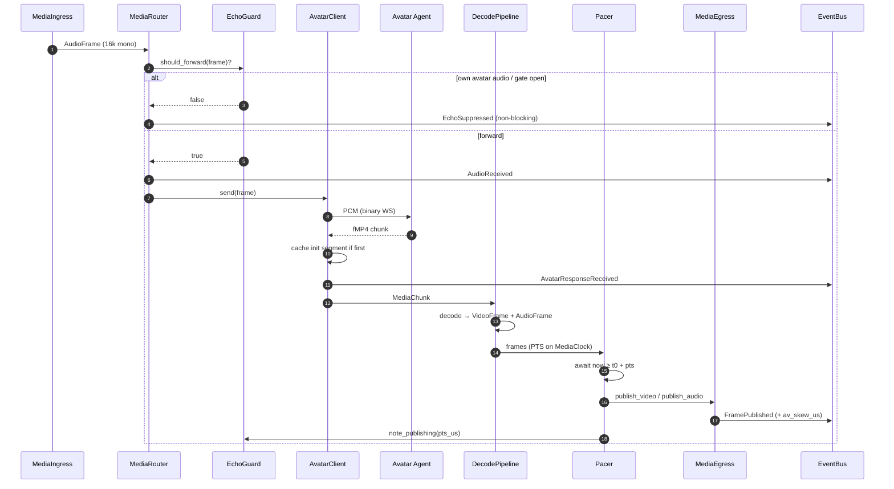
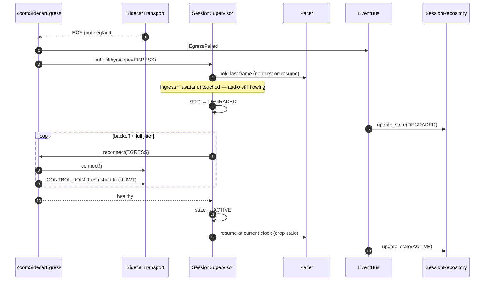
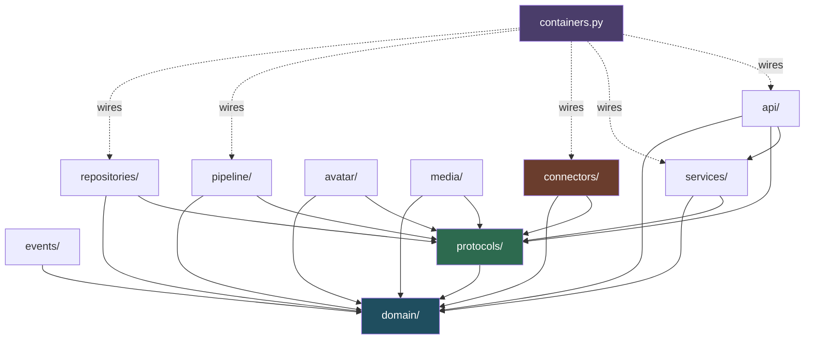
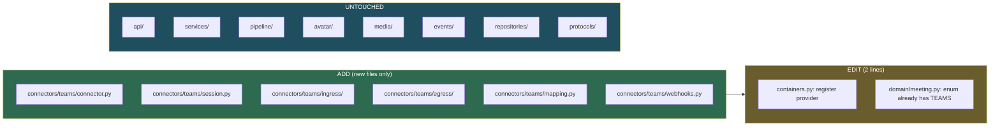

# Architecture Review & Refinement — Multi-Platform Meeting Connectors

**Status:** Phase 1b — Architecture review. No implementation code.
**Baseline:** [001-zoom-avatar-bridge.md](./001-zoom-avatar-bridge.md) — treated as authoritative; preserved except where noted.
**Date:** 2026-08-05
**Target:** Production system supporting Zoom, Microsoft Teams, Google Meet against a **fixed** avatar interface.

---

## 0. Executive Summary

The baseline's *media engineering* is sound and survives intact — RTMS ingest, Meeting SDK publish, C++ sidecar, shared media clock, echo prevention, bounded queues. What does not survive is its *shape*: it is a Zoom-shaped application with Zoom vocabulary reaching into the bridge, the API, and the session model.

I validated the two new platforms before redesigning the abstractions, because an interface generalized from Zoom alone would have been wrong. Three findings reshape the design:

| # | Finding | Consequence |
|---|---|---|
| **F1** | **Google Meet Media API is receive-only.** "The Google Meet Media API can only receive media data (no sending messages or Output Media)"; audio arrives as *receive-only* SRTP streams. There is no official publish path. | A single `MeetingConnector` with `publish_video()` is **unimplementable** for Meet. The proposed fat interface would force `NotImplementedError` — a Liskov violation baked into the core abstraction. |
| **F2** | **Teams app-hosted media is Windows + C# only.** "An application-hosted bot must be hosted in a Windows environment", on "a Windows Server guest OS in Azure", and "you can't use C++ or Node.js APIs to access real-time media." | The sidecar pattern generalizes, but **not the Unix domain socket**. Teams' sidecar is a .NET service on a *different host and OS*. IPC transport must be an abstraction, not a fixed UDS. |
| **F3** | **Zoom's pure-Python ingest is the exception, not the rule.** Meet's client is C++/TypeScript WebRTC and requires Developer Preview enrollment for *all* participants; Teams ingest is bound to the same .NET media session as egress. | Ingest cannot be assumed in-process. Every port must be transport-agnostic and sidecar-capable. Also: on Teams, ingest and egress share one session — they cannot be independently reconnected as they are on Zoom. |

**Capability matrix — the fact base that drives every decision below:**

| Platform | Receive audio | Publish A/V | Per-participant audio | Publish runtime | Native audio |
|---|---|---|---|---|---|
| **Zoom** | RTMS (WSS, native Python) | Meeting SDK raw data | ✅ `AUDIO_MULTI_STREAMS` | Linux C++ sidecar, UDS | PCM L16 16 kHz ✅ |
| **Teams** | Real-time Media Platform | ✅ send/receive, frame-by-frame | ⚠️ mixed by default | **Windows .NET sidecar, network IPC** | SILK / G.722 → PCM |
| **Google Meet** | Meet Media API (WebRTC) | ❌ **none** | ✅ separate streams | C++ sidecar for ingest | Opus 48 kHz → resample |

The headline: **the three platforms disagree on the one thing the proposed interface assumed they'd agree on.** The refinement makes capability explicit, typed, and negotiated at session creation.

The rest of this document works through the ten directives, then delivers the folder structure, class/sequence/dependency diagrams, a module-by-module SOLID audit, and an extensibility proof.

---

## 1. Review of the Baseline

### 1.1 What survives unchanged

These were correct and are load-bearing. Directive 10 asked they be preserved; none needed changing.

✅ RTMS for ingest · ✅ Meeting SDK for publish · ✅ Python bridge · ✅ C++ sidecar · ✅ UDS IPC *(now one transport among several)* · ✅ asyncio · ✅ FastAPI · ✅ DI · ✅ structured logging · ✅ shared media clock · ✅ echo prevention · ✅ session manager · ✅ media router · ✅ feature-driven layout

The latency budget, the fMP4 requirement (A1), the bounded-queue drop policy, and the failure-recovery matrix carry forward verbatim.

### 1.2 What must change — seven concrete defects

| # | Defect in baseline | Principle violated | Fix |
|---|---|---|---|
| **D1** | `ZoomBridge` was a facade doing session lifecycle + subscriber wiring + publisher wiring + reconnect. | SRP | Decompose → `MeetingService`, `ConnectorSession`, `SessionSupervisor`. §4 |
| **D2** | Ingest and publish behind one Zoom-shaped object; API layer imported `connectors.zoom`. | DIP | `MeetingService` + `ConnectorRegistry`; API never names a platform. §4 |
| **D3** | `MediaRouter` did routing + echo gating + decode orchestration + pacing handoff. | SRP | Split → `MediaRouter`, `EchoGuard`, `DecodePipeline`, `Pacer`. §6 |
| **D4** | `Mp4Decoder` protocol named after a container format. | OCP | Rename `MediaDecoder`; container is an implementation detail. §7 |
| **D5** | `FileSinkPublisher` / `NullPublisher` lived in `connectors/zoom/publisher.py` — platform-agnostic test doubles trapped inside the Zoom package. | SRP, DIP | Move to `media/sinks/`. Usable by Teams/Meet and by tests with zero Zoom import. |
| **D6** | `bridge/heartbeat.py` conflated **RTMS protocol keep-alive** (`msg_type 12/13` — a Zoom wire detail) with **session liveness** (a domain concern). | SRP, leaky abstraction | Protocol keep-alive → `connectors/zoom/ingress/keepalive.py`. Session liveness → `services/session/`. §10 |
| **D7** | Pydantic RTMS wire models (`msg_type`, `rtms_stream_id`) were the types the router consumed. | Anti-corruption | Wire models never leave the connector. Canonical domain model. §3 |

D7 is the most consequential. It is the defect the user's own suggestion identified, and it is the one that would have made Teams and Meet expensive.

---

## 2. Change 1 — Segregated Connector Ports

### 2.1 Why the proposed interface cannot be used as specified

The directive proposes:

```
MeetingConnector: join, leave, receive_audio, publish_audio, publish_video, health, reconnect
```

Seven methods, one interface. Given F1 and F2 this fails three ways:

1. **Liskov (fatal).** `GoogleMeetConnector.publish_video()` cannot be implemented. Any `MeetingConnector` reference that calls it is unsound. A caller holding the base type cannot rely on the contract — the definition of an LSP violation.
2. **Interface Segregation.** A subtitle service needs `receive_audio` and nothing else. A test double for the publish path must stub all seven methods. Consumers are coupled to methods they never call.
3. **Lifecycle mismatch.** On Zoom, ingest (RTMS) and egress (sidecar) fail and recover *independently* — that separation was the whole point of the baseline's §3.2. A single `reconnect()` erases it. On Teams the opposite holds: one media session, so one reconnect. A single flat interface cannot express both.

Directive 9 explicitly asks me to propose a better design where SOLID is violated. This is that proposal.

### 2.2 The refined ports

Four small interfaces, composed. The name `MeetingConnector` is retained — as a **factory and capability descriptor**, not a god object.

```python
# protocols/connector.py


class MeetingConnector(Protocol):
    """Stateless, one per platform, registered once in the DI container."""

    platform: ClassVar[MeetingPlatform]
    capabilities: ClassVar[ConnectorCapabilities]

    async def open(self, meeting: MeetingContext) -> ConnectorSession: ...


class ConnectorSession(Protocol):
    """Stateful, one per live meeting."""

    async def join(self) -> None: ...
    async def leave(self) -> None: ...
    async def reconnect(self, scope: ReconnectScope) -> None: ...
    async def health(self) -> HealthReport: ...

    @property
    def ingress(self) -> MediaIngress: ...
    @property
    def egress(self) -> MediaEgress | None: ...  # None ⟺ platform cannot publish


# protocols/media.py


class MediaIngress(Protocol):
    async def start(self) -> None: ...
    async def stop(self) -> None: ...
    def audio(self) -> AsyncIterator[AudioFrame]: ...  # canonical frames only


class MediaEgress(Protocol):
    async def start(self) -> None: ...
    async def stop(self) -> None: ...
    async def publish_audio(self, frame: AudioFrame) -> None: ...
    async def publish_video(self, frame: VideoFrame) -> None: ...
```

Every method the directive asked for is present. They are distributed by *role* rather than piled into one type.

**Two decisions worth defending:**

**Stateless connector / stateful session.** The baseline instantiated a connector per meeting. Splitting them means one `ZoomConnector` singleton in the DI container serves N concurrent meetings, and `MeetingService` can query `capabilities` *without* opening anything. Capability negotiation before resource allocation is what makes fail-fast possible (§2.4).

**`egress: MediaEgress | None`.** This is F1 rendered in the type system. `GoogleMeetConnector` returns `None`; a type checker then forces every caller to handle absence. Compare the alternative — an exception at frame 1, thirty seconds into a live meeting. The Meet limitation becomes a compile-time fact instead of a production incident.

**`ReconnectScope`** (`INGRESS | EGRESS | FULL`) resolves the F2 lifecycle mismatch: Zoom recovers each leg independently, Teams declares only `FULL`.

### 2.3 Capability descriptor

```python
@dataclass(frozen=True, slots=True)
class ConnectorCapabilities:
    can_receive_audio: bool
    can_publish_audio: bool
    can_publish_video: bool
    per_participant_audio: bool  # ⟹ echo suppression strategy 1 available
    native_audio_format: AudioFormat  # ⟹ resampler inserted only if ≠ avatar format
    publish_video_format: VideoFormat | None
    max_publish_fps: int | None
    requires_sidecar: bool
    reconnect_scopes: frozenset[ReconnectScope]
```

This descriptor is the mechanism by which the pipeline configures itself per platform instead of branching on platform identity. There is no `if platform == ZOOM` anywhere outside `connectors/`.

Two fields earn their place:

- **`per_participant_audio`** — baseline §6.3 relied on `AUDIO_MULTI_STREAMS` for echo suppression. Teams mixes audio by default. `EchoGuard` reads this flag and escalates to strict gating when per-participant attribution is unavailable, rather than silently feeding the avatar its own voice.
- **`native_audio_format`** — see §3.2.

### 2.4 Capability negotiation

```
MeetingService.create_session(url, features)
  → resolve platform from URL
  → look up connector in registry
  → require(capabilities ⊇ features)
  → reject at HTTP 422 if unsatisfiable
```

A Google Meet URL submitted for an avatar session is rejected **at creation**, with a precise reason, before a session row, a sidecar, or a WebSocket exists.

---

## 3. Change 2 — Canonical Media & Session Model (Anti-Corruption Layer)

This addresses the user's addition and baseline defect D7. It is the single highest-leverage change in this review.

### 3.1 The rule

> **No platform SDK type, wire model, or vocabulary crosses the connector boundary — in either direction.**

Connectors translate at their edge. Everything inward speaks the canonical model.

```
Zoom RTMS msg_type 14 ─┐
Teams AudioMediaBuffer ─┼─► [connector mapping layer] ─► domain.AudioFrame ─► pipeline
Meet SRTP/Opus track  ─┘
```

### 3.2 The canonical model

```python
# domain/media.py


class SampleFormat(StrEnum):
    S16LE = "s16le"


@dataclass(frozen=True, slots=True)
class AudioFormat:
    sample_rate_hz: int
    channels: int
    sample_format: SampleFormat


@dataclass(frozen=True, slots=True)
class VideoFormat:
    width: int
    height: int
    pixel_format: PixelFormat  # I420
    fps: int


@dataclass(frozen=True, slots=True)
class AudioFrame:
    pcm: bytes
    pts_us: int  # on the session MediaClock
    format: AudioFormat
    participant: ParticipantRef | None  # None ⟺ mixed stream


@dataclass(frozen=True, slots=True)
class VideoFrame:
    planes: bytes  # I420
    pts_us: int
    format: VideoFormat


@dataclass(frozen=True, slots=True)
class MediaChunk:
    """Opaque container bytes from the avatar (fMP4)."""

    data: bytes
    seq: int
    is_init_segment: bool  # ftyp+moov — see §3.4
    received_at_us: int
```

```python
# domain/meeting.py, domain/session.py


class MeetingPlatform(StrEnum):
    ZOOM = "zoom"
    TEAMS = "teams"
    GOOGLE_MEET = "google_meet"


@dataclass(frozen=True, slots=True)
class MeetingContext:
    platform: MeetingPlatform
    meeting_id: str
    meeting_url: str | None
    display_name: str
    passcode: str | None
    platform_data: Mapping[str, Any]  # opaque; connector-private (see note)


@dataclass(slots=True)
class SessionContext:
    session_id: SessionId
    correlation_id: str
    meeting: MeetingContext
    state: SessionState
    clock: MediaClock
    started_at: datetime
    ended_at: datetime | None
    last_heartbeat: datetime | None
```

**On `platform_data`.** A deliberate, bounded escape hatch. Zoom's join needs `rtms_stream_id` + `server_urls`; Teams needs a Graph call ID; Meet needs a conference record name. Rather than union-typing the domain around three SDKs, the payload stays opaque and is **validated into a typed Pydantic model inside the owning connector, at the boundary, on entry**. Nothing outside that connector may read a key from it. The alternative — a `JoinCredentials` sealed union — pushes every platform's shape into the domain, which is exactly the coupling we are removing.

### 3.3 The avatar contract as an architectural invariant

The avatar interface is fixed and will never change. That makes it the ideal anchor for the whole pipeline, so it is expressed as a domain constant rather than scattered configuration:

```python
# domain/avatar.py
AVATAR_INPUT_FORMAT = AudioFormat(16_000, 1, SampleFormat.S16LE)
AVATAR_OUTPUT_CONTAINER = ContainerFormat.FRAGMENTED_MP4
```

The pipeline then derives its own configuration:

```
resampler_required = connector.capabilities.native_audio_format != AVATAR_INPUT_FORMAT
```

| Platform | Native | Resampler on ingest |
|---|---|---|
| Zoom | PCM L16 16 kHz mono | **none** — baseline's zero-resample property, now provable rather than incidental |
| Teams | SILK/G.722 → PCM | inserted (rate confirmed at implementation) |
| Meet | Opus 48 kHz | inserted, 48 k → 16 k |

Zoom's format match stops being a happy accident and becomes a measured property of a declared capability.

### 3.4 Why `is_init_segment` exists

Baseline §10 restarts the decoder on a bad fragment. But an fMP4 decoder cannot resume from a mid-stream `moof` — it needs the `ftyp`+`moov` init segment first. So `AvatarClient` **caches the init segment for the session's lifetime and replays it into every new decoder instance.** Without this, decoder restart produces permanent black video: recovery that appears to succeed and doesn't. Making it a typed field on `MediaChunk` means the requirement cannot be forgotten.

---

## 4. Change 3 — Service Layer & MeetingService

### 4.1 Target flow (directive 7)

```
HTTP / platform notification
        ↓
   MeetingService          ← platform selection, capability check, lifecycle
        ↓
  MeetingConnector → ConnectorSession
        ↓                    ↓
   MediaIngress         MediaEgress
        ↓                    ↑
   MediaRouter ──► AvatarClient ──► DecodePipeline ──► Pacer
```

### 4.2 Responsibilities

```python
class MeetingService:
    def __init__(
        self,
        registry: ConnectorRegistry,
        url_parser: MeetingUrlResolver,
        sessions: SessionRepository,
        supervisor: SessionSupervisor,
        events: EventBus,
    ) -> None: ...

    async def create_session(self, req: CreateSessionCommand) -> SessionContext: ...
    async def stop_session(self, session_id: SessionId) -> None: ...
    async def get_session(self, session_id: SessionId) -> SessionContext | None: ...
    async def list_sessions(self, f: SessionFilter) -> Sequence[SessionContext]: ...
```

Note what it does *not* do: it never touches media. It allocates and supervises; `SessionSupervisor` owns the `asyncio.TaskGroup` and restart policy; the pipeline owns frames. Three separate reasons to change, three objects (fixes D1).

### 4.3 Connector selection

```python
class ConnectorRegistry:
    def register(self, connector: MeetingConnector) -> None: ...
    def get(self, platform: MeetingPlatform) -> MeetingConnector: ...
    def capabilities(self, platform: MeetingPlatform) -> ConnectorCapabilities: ...
    def supported(self) -> frozenset[MeetingPlatform]: ...
```

Populated once from the DI container. Adding Teams = registering one provider. No `if/elif` on platform, anywhere — OCP by construction.

`MeetingUrlResolver` composes per-platform `UrlPattern` objects contributed by each connector package, so `POST /meetings {"url": "..."}` resolves the platform automatically. Adding a platform adds a pattern; the resolver is untouched.

### 4.4 Keeping FastAPI platform-blind — including webhooks

The API layer's DTOs and routers reference `MeetingPlatform` (a domain enum) and nothing else. But Zoom *requires* a platform-specific inbound webhook (`meeting.rtms_started`), Teams uses Graph call notifications, and Meet uses neither. Hiding that behind a generic endpoint would be dishonest — the payloads and signature schemes genuinely differ.

Resolution — each connector package owns its notification adapter, and the app mounts them generically:

```python
class PlatformNotificationAdapter(Protocol):
    platform: ClassVar[MeetingPlatform]

    def router(self) -> APIRouter: ...  # depends only on MeetingService
```

```python
# api/app.py — the only wiring, and it names no platform
for adapter in container.notification_adapters():
    app.include_router(adapter.router(), prefix=f"/webhooks/{adapter.platform}")
```

`api/` imports no connector. Signature verification, payload shape, and event vocabulary stay inside the connector that owns them; the adapter emits domain commands on `MeetingService`. Adding Teams adds a file under `connectors/teams/` and changes nothing in `api/`.

---

## 5. Change 4 — Two-Plane Event Architecture

### 5.1 The tension worth naming

Directive 5 asks for `AudioReceived → MediaRouter → AvatarClient → AvatarResponseReceived → MediaPublisher → FramePublished`, with future analytics/recording/subtitles subscribing without modifying existing modules. That goal is right and is fully delivered. But routing the *media hot path* through a fan-out bus has two real costs:

1. **Latency and allocation.** 50 audio frames/s + 25 video frames/s per session, each becoming an event object dispatched to a subscriber list, inside a budget where the bridge owns only 45–125 ms.
2. **Backpressure incoherence — the serious one.** A bus with multiple subscribers has no single well-defined backpressure semantic. If the recording service stalls on disk I/O, does participant audio stall behind it? Any answer that keeps the meeting healthy means the bus is *already* dropping — so it is not really the transport. Baseline §7.2's explicit per-stage depths and drop policies cannot be expressed as bus semantics.

### 5.2 The resolution: events describe, queues carry

Two planes, one vocabulary.

**Data plane** (`pipeline/`) — the hot path. Direct typed calls over bounded queues with per-stage drop policy and real backpressure. Latency-budgeted. Baseline §7.2 preserved exactly.

**Control plane** (`events/`) — the async bus. Session lifecycle, state transitions, metrics samples, errors, reconnects, and **media taps** for optional consumers. Fire-and-forget; a subscriber can never block the data plane.

```
   ┌──────────── DATA PLANE (bounded queues, backpressure) ────────────┐
   │ MediaIngress → MediaRouter → AvatarClient → Decoder → Pacer → Egress │
   └───────┬───────────┬──────────────┬───────────────┬────────────────┘
           │ emit      │ emit         │ emit          │ emit      (non-blocking)
           ▼           ▼              ▼               ▼
   ╔═══════════════════ CONTROL PLANE (async event bus) ═══════════════╗
   ║ AudioReceived  AvatarResponseReceived  FrameDecoded  FramePublished║
   ╚═══╤══════════════╤═══════════════╤═════════════════╤══════════════╝
       ▼              ▼               ▼                 ▼
   Metrics      Persistence      Logging        [future: recording,
   Subscriber   Subscriber       Subscriber      subtitles, analytics]
```

The event vocabulary is exactly as specified. The refinement is that events carry **metadata plus an optional frame reference**, and each subscriber gets its **own bounded queue with drop-on-full**. A slow subscriber degrades *itself* — it never degrades the meeting.

```python
class EventBus(Protocol):
    def publish(self, event: DomainEvent) -> None: ...  # sync, non-blocking
    def subscribe(
        self,
        event_type: type[E],
        handler: Handler[E],
        *,
        queue_size: int = 256,
        policy: OverflowPolicy = DROP_OLDEST,
    ) -> Subscription: ...
```

`publish()` is deliberately **synchronous and non-awaitable**: it appends to subscriber queues and returns. It cannot suspend the media path, and no `await` on the hot path can accidentally serialize behind a subscriber. Subscribers run in their own supervised tasks.

`MediaTap` is the sanctioned way to consume frames off-path: recording and subtitles subscribe to a tap, accept documented frame loss under pressure, and require no change to `MediaRouter` — Open/Closed satisfied for the extension case the directive actually cares about.

**Verdict:** directive 5's goal — new services subscribe without modifying existing modules — is met in full. Only the media *transport* stays on the data plane, because that is where the latency budget and the drop policy live.

---

## 6. Change 5 — Pipeline Decomposition

Fixes D3. The baseline `MediaRouter` had four reasons to change.

| Component | Single responsibility |
|---|---|
| `MediaRouter` | Move frames between ingress, avatar, and egress. Routing only. |
| `EchoGuard` | Decide whether an inbound frame is our own avatar. Own-participant filter + speaking gate + hangover. Reads `per_participant_audio`. |
| `DecodePipeline` | Own decoder lifecycle: feed chunks, restart on failure, replay cached init segment. |
| `Pacer` | Release frames at PTS on the `MediaClock`. Drop-late, gap-fill audio. |
| `BoundedFrameQueue` | Depth + overflow policy + drop counters. |
| `MediaTap` | Non-blocking fan-out to control-plane subscribers. |
| `MediaClock` | Single monotonic time base per session. |

`EchoGuard` becoming a named, injected policy object is a direct multi-platform win: Zoom uses per-participant filtering, Teams falls back to strict gating, and the difference is a constructor argument rather than a branch inside the router.

---

## 7. Change 6 — MediaDecoder Port

Fixes D4.

```python
class MediaDecoder(Protocol):
    async def start(self, init_segment: MediaChunk | None) -> None: ...
    async def feed(self, chunk: MediaChunk) -> None: ...
    def video(self) -> AsyncIterator[VideoFrame]: ...
    def audio(self) -> AsyncIterator[AudioFrame]: ...
    async def stop(self) -> None: ...
    @property
    def health(self) -> ComponentHealth: ...
```

Implementations: `FfmpegDecoder` (PoC default — subprocess isolation, malformed input can't crash us), `PyAvDecoder` (lower latency, in-process). Selected by config through a `MediaDecoderFactory`; `DecodePipeline` depends only on the protocol.

The name drops `Mp4`: the container is a detail of the current avatar contract, and a future WebM or raw-frame transport should not require renaming the port. `start(init_segment=...)` encodes the §3.4 replay requirement into the signature.

---

## 8. Change 7 — Metrics Service

`services/metrics/`, subscribing to the control plane. Business logic never imports it; modules emit events, the metrics subscriber interprets them. Removing metrics entirely would not change a single line of pipeline code.

```python
class MetricsService(Protocol):
    def observe(self, metric: MetricName, value_us: float, **labels: str) -> None: ...
    def increment(self, metric: MetricName, **labels: str) -> None: ...
    def snapshot(self) -> MetricsSnapshot: ...
```

Tracked, all labeled by `platform` and `session_id` — the labels are what make cross-platform comparison possible:

| Metric | Type |
|---|---|
| `ingest_to_router_us`, `router_to_avatar_us`, `avatar_rtt_us`, `decode_us`, `pace_wait_us`, `publish_us`, `end_to_end_us` | histogram (p50/p95/p99) |
| `websocket_send_us`, `sidecar_ipc_us` | histogram |
| `audio_delay_us`, `video_delay_us`, `av_skew_us` | histogram |
| `frames_dropped_total{stage,reason}` | counter |
| `reconnects_total{component,scope}` | counter |
| `decoder_restarts_total`, `echo_frames_suppressed_total` | counter |

`av_skew_us` is added deliberately: it is the direct observable for the known Zoom send-audio/send-video desync risk from baseline §7.1, and the only way to know whether the shared media clock is actually working in production.

Exposed at `/metrics` (Prometheus) — independent of business logic, per the directive.

---

## 9. Change 8 — Session Repository

```python
class SessionRepository(Protocol):
    async def create(self, session: SessionRecord) -> None: ...
    async def update_state(
        self, sid: SessionId, state: SessionState, error: SessionError | None = None
    ) -> None: ...
    async def heartbeat(self, sid: SessionId, at: datetime) -> None: ...
    async def get(self, sid: SessionId) -> SessionRecord | None: ...
    async def list_active(self) -> Sequence[SessionRecord]: ...
    async def close(self, sid: SessionId, at: datetime) -> None: ...
```

Schema per directive 6: session ID, platform, meeting URL, meeting ID, state, started/ended at, last heartbeat, connector name, errors (append-only child table — a session can fail more than once and the sequence is the diagnostic value).

`SqliteSessionRepository` via `aiosqlite`, WAL mode. Postgres later with no change above the port.

**Two constraints that matter more than the schema:**

1. **The repository is never on the media path.** Persistence happens on the control plane via `PersistenceSubscriber`. A disk stall must not add latency to audio.
2. **Heartbeats are throttled** to one write per N seconds (default 5), not per frame. At 50 fps unthrottled this would be 50 writes/s/session against a single SQLite writer lock — the repository would become the bottleneck. Called out because it is an easy and expensive mistake.

---

## 10. Change 9 — Generalized Sidecar (New; driven by F2)

The baseline hardcoded UDS. F2 makes that untenable: Teams' media runtime is **C#/.NET on Windows Server**, potentially a different host. So the sidecar becomes a first-class pattern with a pluggable transport.

```python
class SidecarTransport(Protocol):
    async def connect(self) -> None: ...
    async def send(self, frame: SidecarFrame) -> None: ...
    def receive(self) -> AsyncIterator[SidecarFrame]: ...
    async def close(self) -> None: ...
```

| Transport | Use |
|---|---|
| `UdsTransport` | Zoom C++ bot, same container. Lowest latency. Baseline default, preserved. |
| `TcpTransport` (mTLS) | Teams .NET bot on a Windows host. |
| `InProcessTransport` | Tests — no process, no socket. |

The length-prefixed binary framing from baseline §3.4 is retained and shared, in `connectors/base/sidecar/`. Also shared: `ReconnectPolicy` (backoff + full jitter), supervision, and health probing — every platform needs these, so they live in `connectors/base/` and each connector inherits rather than reimplements.

Sidecar-based *ingress* is now supported too (F3: Meet's client is C++/WebRTC), which the baseline's publish-only sidecar assumption did not allow for.

---

## 11. Updated Folder Structure

```
src/
├── api/                          # HTTP only. Imports domain + services. NO connector imports.
│   ├── app.py                    #   mounts notification adapters from the registry
│   ├── dependencies.py
│   ├── dto/                      #   platform-agnostic request/response models
│   └── routers/                  #   meetings.py · health.py · metrics.py
│
├── services/                     # Orchestration. No media frames.
│   ├── meeting/                  #   service.py · registry.py · url_resolver.py
│   ├── session/                  #   lifecycle.py (state machine) · supervisor.py (TaskGroup)
│   └── metrics/                  #   service.py · histogram.py · exporters/
│
├── protocols/                    # Ports. Depends ONLY on domain. The extension contract.
│   ├── connector.py              #   MeetingConnector · ConnectorSession
│   ├── media.py                  #   MediaIngress · MediaEgress · MediaDecoder · MediaSink
│   ├── avatar.py                 #   AvatarAgent
│   ├── repository.py             #   SessionRepository
│   ├── events.py                 #   EventBus · Subscription
│   ├── notifications.py          #   PlatformNotificationAdapter
│   └── sidecar.py                #   SidecarTransport
│
├── domain/                       # Canonical model. Depends on NOTHING.
│   ├── media.py                  #   AudioFrame · VideoFrame · MediaChunk · AudioFormat
│   ├── meeting.py                #   MeetingContext · MeetingPlatform · ParticipantRef
│   ├── session.py                #   SessionContext · SessionState · SessionError
│   ├── avatar.py                 #   AVATAR_INPUT_FORMAT · AVATAR_OUTPUT_CONTAINER
│   ├── capabilities.py           #   ConnectorCapabilities · ReconnectScope
│   └── health.py                 #   HealthReport · ComponentHealth
│
├── connectors/                   # Adapters. The ONLY place platform SDKs may appear.
│   ├── base/                     #   shared: sidecar/{transport,protocol,client}.py
│   │                             #           reconnect.py · supervision.py
│   ├── zoom/
│   │   ├── connector.py          #   ZoomConnector (MeetingConnector)
│   │   ├── session.py            #   ZoomConnectorSession
│   │   ├── ingress/              #   rtms_client · rtms_subscriber · keepalive  ← D6 fix
│   │   ├── egress/               #   sidecar_egress.py
│   │   │   └── sidecar/          #   C++ Meeting SDK source + CMakeLists.txt
│   │   ├── mapping.py            #   wire → domain  ← the anti-corruption layer
│   │   ├── models.py             #   RTMS wire models. NEVER leave this package.
│   │   ├── auth.py · webhooks.py · config.py · exceptions.py
│   ├── teams/                    #   PLANNED — README documents Windows/.NET sidecar
│   └── google_meet/              #   PLANNED — ingress only (F1); capabilities encode it
│
├── pipeline/                      # DATA PLANE. Bounded queues, backpressure, latency budget.
│   ├── router.py · echo_guard.py · decode_pipeline.py
│   ├── pacer.py · clock.py · queues.py · taps.py
│
├── media/                        # Codecs & sinks. Platform-agnostic.
│   ├── decoders/                 #   ffmpeg.py · pyav.py · factory.py
│   ├── sinks/                    #   file_sink.py · null_sink.py   ← D5 fix
│   └── formats.py                #   resampling · I420 helpers
│
├── avatar/                       # Fixed contract. Never platform-aware.
│   ├── client.py · transport.py · framing.py
│
├── events/                       # CONTROL PLANE.
│   ├── bus.py · types.py
│   └── subscribers/              #   metrics · persistence · logging
│
├── repositories/                 #   models.py · sqlite.py · migrations/
├── config/                       #   settings.py (per-connector nested settings)
├── observability/                #   logging.py · correlation.py
└── containers.py                 # DI wiring. The only module that knows every concrete type.
```

Deviations from the proposed layout, and why:

- **`pipeline/` added** — the data plane needs a home distinct from `media/` (codecs). Keeping them together was baseline D3's structural cause.
- **`connectors/base/` added** — sidecar IPC, reconnect, and supervision are needed by all three platforms (F2, F3). Without it, Teams copy-pastes Zoom's plumbing.
- **`observability/` split from `config/`** — different reasons to change.
- **`bridge/` removed** — it was a Zoom-era name for what is now `pipeline/` + `services/`.

---

## 12. Class Diagrams

### 12.1 Connector ports and the Zoom adapter



`GoogleMeetConnector` implements the same protocol while returning `egress = None`. Substitutability is preserved because absence is in the type, not in an exception — the LSP fix from §2.2, visible in the diagram.

### 12.2 Canonical domain model



### 12.3 Pipeline (data plane)



### 12.4 Services, events, persistence



---

## 13. Sequence Diagrams

### 13.1 Session creation — platform-agnostic



The API sends a URL and a feature list. It never learns which platform served it.

### 13.2 Zoom ingest attach (platform detail, fully encapsulated)



`msg_type` appears nowhere to the right of `mapping.py`. That boundary is the anti-corruption layer.

### 13.3 Media round trip



`note_publishing` closing the loop back to `EchoGuard` is what arms the speaking gate — the second layer of feedback defence from baseline §6.3.

### 13.4 Egress sidecar crash — isolated recovery



`ReconnectScope.EGRESS` is what preserves the baseline's crash-isolation payoff. On Teams — which declares only `FULL` — the same supervisor drives a full rejoin without any change to supervisor code.

---

## 14. Dependency Diagrams

### 14.1 Allowed dependency directions



All arrows point toward `domain/`, which depends on nothing. `connectors/` is a leaf that **nothing imports** except `containers.py`. That is Dependency Inversion made structural rather than aspirational.

### 14.2 The invariants, and enforcing them in CI

```
domain/      → imports nothing from src/
protocols/   → imports only domain/
connectors/  → imported ONLY by containers.py
api/         → must not import connectors/ or platform SDKs
pipeline/    → must not import connectors/
Zoom wire models → must not escape connectors/zoom/
```

Architecture guarded by intention decays. These become an executed test (`tests/architecture/test_dependencies.py`) walking the AST of every module and asserting the import graph. A PR that imports `connectors.zoom` into `pipeline/` fails CI with a named rule. This is how the multi-platform property stays true six months from now — the layering becomes a build error rather than a code-review habit.

### 14.3 What adding a connector touches



---

## 15. SOLID Audit

| Module | S | O | L | I | D | Notes |
|---|:-:|:-:|:-:|:-:|:-:|---|
| `domain/` | ✅ | ✅ | ✅ | ✅ | ✅ | Frozen dataclasses, zero deps. |
| `protocols/` | ✅ | ✅ | ✅ | ✅ | ✅ | Ports segregated by role (§2.2). |
| `MeetingService` | ✅ | ✅ | ✅ | ✅ | ✅ | Was D1; media & supervision extracted. |
| `ConnectorRegistry` | ✅ | ✅ | ✅ | ✅ | ✅ | Lookup only; no platform branching. |
| `SessionSupervisor` | ✅ | ✅ | ✅ | ✅ | ✅ | Owns TaskGroup + restart policy only. |
| `MediaRouter` | ✅ | ✅ | ✅ | ✅ | ✅ | Was D3; four responsibilities → four objects. |
| `EchoGuard` | ✅ | ✅ | ✅ | ✅ | ✅ | Policy object; adapts via capabilities. |
| `Pacer` / `MediaClock` | ✅ | ✅ | ✅ | ✅ | ✅ | Single time base per session. |
| `MediaDecoder` impls | ✅ | ✅ | ✅ | ✅ | ✅ | Was D4; format-neutral port. |
| `AvatarClient` | ✅ | ✅ | ✅ | ✅ | ✅ | Fixed contract; platform-blind. |
| `ZoomConnector` | ✅ | ✅ | ✅ | ✅ | ✅ | Was D2/D7; wire models contained. |
| `RtmsIngress` | ✅ | ✅ | ✅ | ✅ | ✅ | Was D6; protocol keep-alive local. |
| `SidecarTransport` | ✅ | ✅ | ✅ | ✅ | ✅ | New (F2); UDS/TCP/in-process. |
| `EventBus` | ✅ | ✅ | ✅ | ✅ | ✅ | Non-blocking publish; per-subscriber queues. |
| `SessionRepository` | ✅ | ✅ | ✅ | ✅ | ✅ | Port; SQLite→Postgres is a swap. |
| `MetricsService` | ✅ | ✅ | ✅ | ✅ | ✅ | Subscriber-driven; zero coupling. |
| `api/` | ✅ | ✅ | ✅ | ✅ | ✅ | Adapters mounted from registry (§4.4). |
| `media/sinks/` | ✅ | ✅ | ✅ | ✅ | ✅ | Was D5; out of the Zoom package. |

The LSP column is the one that required real design work rather than reorganisation — see §2.2 and F1.

---

## 16. Why This Is More Extensible

Not an assertion — a walk-through of the two connectors we know are coming.

**`GoogleMeetConnector` (receive-only, F1).** Implement `MeetingConnector` + `ConnectorSession` + `MediaIngress`. Declare `can_publish_audio=False, can_publish_video=False`, return `egress=None`, set `native_audio_format=AudioFormat(48_000, 1, S16LE)`. The pipeline inserts a resampler because the format differs from `AVATAR_INPUT_FORMAT`; `MeetingService` rejects avatar sessions at 422 with a precise reason. **Zero changes** to `api/`, `services/`, `pipeline/`, `avatar/`, `media/`, `events/`. In the baseline design this platform could not be represented at all — its interface presumed publishing.

**`TeamsConnector` (Windows/.NET sidecar, F2).** Implement the same three protocols plus a .NET sidecar speaking the shared framing over `TcpTransport` (mTLS). Declare `per_participant_audio=False` → `EchoGuard` escalates to strict gating automatically. Declare `reconnect_scopes={FULL}` → the supervisor performs full rejoin instead of per-leg recovery. Both behavioural differences are **data**, not code. Reuses `connectors/base/` for framing, reconnect, and supervision.

**The load-bearing properties:**

1. **The avatar contract is an invariant, not a variable.** `AVATAR_INPUT_FORMAT` is one domain constant; each connector declares its native format; the resampler is derived. Adapting to a new platform's audio format is a declaration.
2. **Capability is data.** Behaviour varies by declared capability, not by `isinstance` or platform branching. Adding a platform adds a row, not a case.
3. **The anti-corruption layer holds.** No SDK type crosses the boundary, so no platform can make the pipeline learn its vocabulary — and CI enforces it (§14.2).
4. **Absence is typed.** `egress: MediaEgress | None` turns Meet's hard limitation into a checked condition instead of a runtime surprise.
5. **The extension contract is one package.** `protocols/` is the literal answer to "what do I implement to add a platform?"
6. **New consumers need no edits.** Recording, subtitles, analytics subscribe to the control plane; the data plane never learns they exist.

**Cost, honestly stated.** More indirection than the baseline: an extra hop from service to session to ingress, and capability lookups where a direct call would do. For a single-platform PoC that is overhead. For three platforms with materially different capabilities — one of which cannot publish at all and one of which needs a different OS — it is the cheaper position. The C++/.NET sidecar boundary and the fixed avatar contract are both stable, so this indirection is being spent on the axis that actually varies.

---

## 17. Preserved Decisions (Directive 10)

| Decision | Status |
|---|---|
| RTMS for media ingest | ✅ unchanged |
| Meeting SDK publishing | ✅ unchanged |
| Python bridge | ✅ unchanged |
| C++ sidecar | ✅ unchanged; generalized to a pattern (§10) |
| Unix domain socket IPC | ✅ retained as Zoom default; now one `SidecarTransport` among several (F2) |
| AsyncIO / FastAPI | ✅ unchanged |
| Feature-driven architecture | ✅ strengthened — features are now platform-independent |
| Dependency injection | ✅ expanded — registry-driven |
| Structured logging | ✅ unchanged; `observability/` split out |
| Shared media clock | ✅ unchanged; `av_skew_us` added to verify it |
| Echo prevention | ✅ unchanged; extracted as `EchoGuard`, capability-driven |
| Session manager | ✅ split into `SessionSupervisor` + `SessionLifecycle` (D1) |
| Media router | ✅ retained; decomposed (D3) |

Only the UDS decision was materially altered, forced by F2 (Teams cannot run on Linux). Zoom's behaviour is byte-identical.

---

## 18. Updated Risks

Carried from baseline §12: **A1 (fMP4 required)** and **A3 (real meetings vs Video SDK)** — acknowledged as being handled on the agent side.

New, from this review:

| # | Risk | Mitigation |
|---|---|---|
| R1 | **Google Meet cannot publish.** No official API. | Encoded in capabilities; rejected at session creation. Revisit only if Google ships an output API. |
| R2 | **Teams requires Windows + C#.** Different OS and deployment unit. | `SidecarTransport` abstraction; Teams sidecar is a separate artifact. Plan before committing to Teams. |
| R3 | **Meet Developer Preview requires all participants enrolled.** | Product constraint, not technical. Flag before scoping Meet. |
| R4 | Event bus becomes a hidden hot path if media is routed through it. | Structural: `publish()` is non-awaitable; architecture test asserts `pipeline/` does not await bus calls. |
| R5 | SQLite writer contention under many sessions. | Throttled heartbeats (§9); WAL; Postgres swap behind the port. |
| R6 | Abstraction cost with only one connector shipped. | Accepted. §16 states the tradeoff plainly. |

---

## 19. Migration Plan

The baseline milestones are preserved; refactors are inserted where they cost least.

| Step | Work | Rationale |
|---|---|---|
| **M1** | `domain/` + `protocols/` + `config/` + `observability/` + DI skeleton | Ports and canonical model first — they are the contract everything else is written against. |
| **M1b** | `events/` bus + `repositories/` SQLite + `services/metrics/` | Cross-cutting infrastructure before features depend on it. |
| **M2** | `connectors/zoom/` ingress + `mapping.py` + webhook adapter | **Goal 1.** First proof the anti-corruption layer holds. |
| **M2b** | `services/meeting/` + `services/session/` + `api/` | **Goal 1 end-to-end**, platform-blind from the HTTP edge. |
| **M3** | `avatar/` client + `pipeline/` router + `EchoGuard` | **Goal 2.** |
| **M4** | `media/decoders/` + `DecodePipeline` + `Pacer` + `media/sinks/FileSink` | **Goals 3 & 4** — watchable output, still no SDK build needed. |
| **M5** | `connectors/base/sidecar/` + Zoom C++ bot + `ZoomSidecarEgress` | **Goal 5.** Shared sidecar layer built once, for Teams later. |
| **M6** | Metrics histograms, chaos tests, `tests/architecture/` | **Goal 6** measured; layering enforced in CI. |

M1–M4 still require no Zoom SDK build and no entitlement — the baseline's de-risking property is intact. The added cost of this refactor is concentrated in M1/M1b, before any media code exists, which is the cheapest possible moment.

---

## 20. Approval Gate

| # | Decision | Recommendation |
|---|---|---|
| 1 | Split `MeetingConnector` into `MeetingConnector` + `ConnectorSession` + `MediaIngress` + `MediaEgress` (§2.2) | ✅ **Required by F1** — a fat interface is unimplementable for Meet |
| 2 | Stateless connector / stateful session | ✅ Recommended — enables capability checks before allocation |
| 3 | `egress: MediaEgress \| None` to type Meet's limitation | ✅ Recommended |
| 4 | Canonical domain model + anti-corruption rule, CI-enforced (§3, §14.2) | ✅ **Highest-leverage change** |
| 5 | Two-plane architecture: queues carry, events describe (§5) | ✅ Recommended — full event vocabulary, no backpressure loss |
| 6 | `pipeline/` and `connectors/base/` added to the proposed structure (§11) | ✅ Recommended |
| 7 | Generalize sidecar IPC to `SidecarTransport` (§10) | ✅ **Required by F2** — Teams is Windows/.NET |
| 8 | Throttled heartbeats; repository off the media path (§9) | ✅ Recommended |
| 9 | Teams/Meet as documented stubs with real capability descriptors | ✅ Recommended — keeps the abstraction honest |

On approval I'll begin M1: `domain/` and `protocols/` — the canonical model and ports — then proceed module by module.

---

## References

Baseline references carry forward from [001](./001-zoom-avatar-bridge.md). New for this review:

- [Meet Media API — overview](https://developers.google.com/workspace/meet/media-api/guides/overview)
- [Meet Media API — get started (Developer Preview enrollment)](https://developers.google.com/workspace/meet/media-api/guides/get-started)
- [Meet Media API — concepts](https://developers.google.com/workspace/meet/media-api/guides/concepts)
- [What is the Google Meet Media API? — receive-only constraint](https://www.recall.ai/blog/what-is-the-google-meet-media-api)
- [Teams — build application-hosted media bots (Windows requirement)](https://learn.microsoft.com/en-us/microsoftteams/platform/bots/calls-and-meetings/requirements-considerations-application-hosted-media-bots)
- [Teams — real-time media concepts](https://learn.microsoft.com/en-us/microsoftteams/platform/bots/calls-and-meetings/real-time-media-concepts)
- [Graph Communications Bot Media SDK](https://microsoftgraph.github.io/microsoft-graph-comms-samples/docs/bot_media/index.html)
- [Teams — calls and meetings bots overview](https://learn.microsoft.com/en-us/microsoftteams/platform/bots/calls-and-meetings/calls-meetings-bots-overview)
