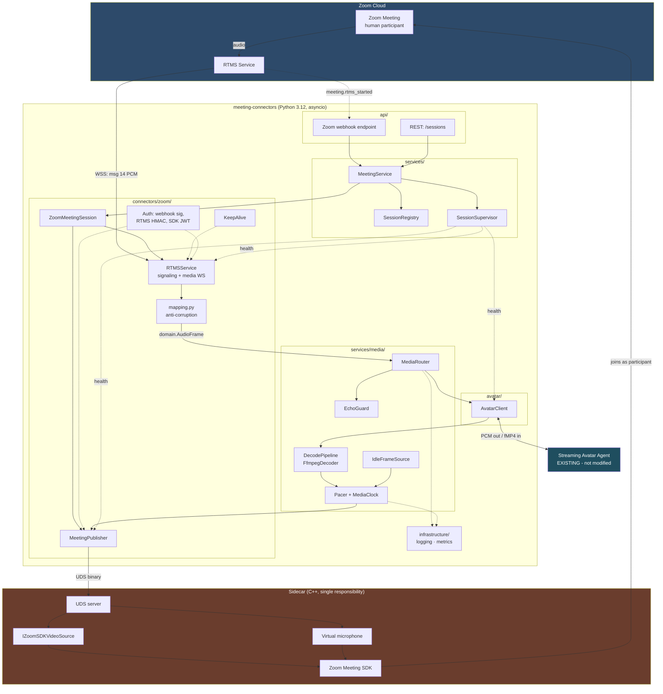
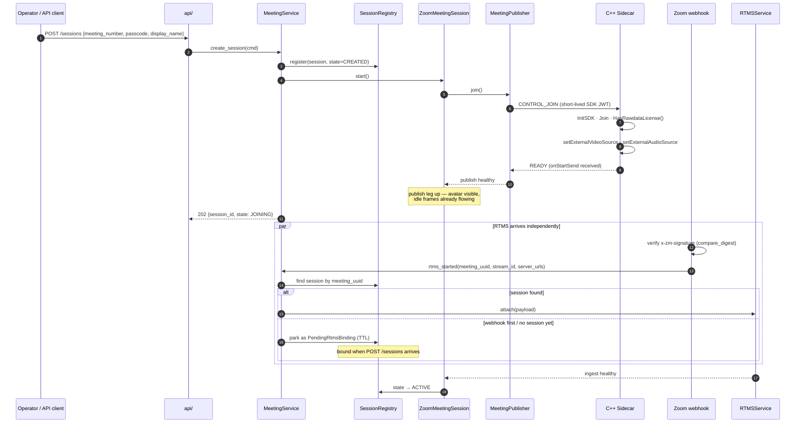
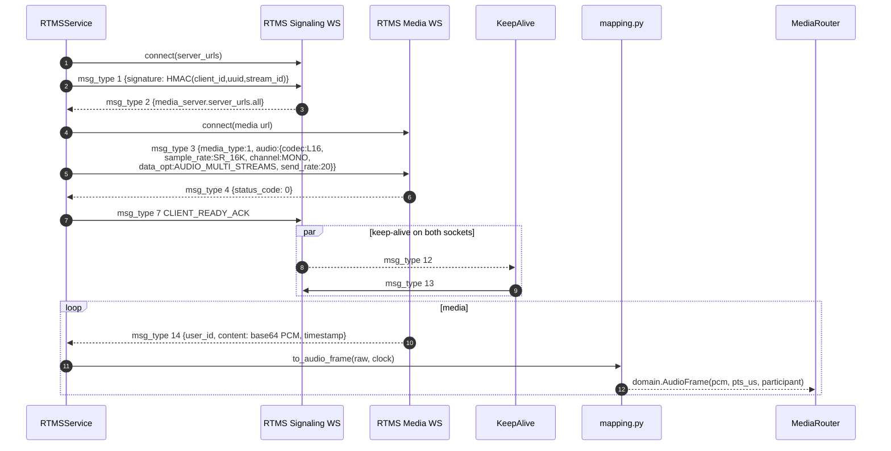
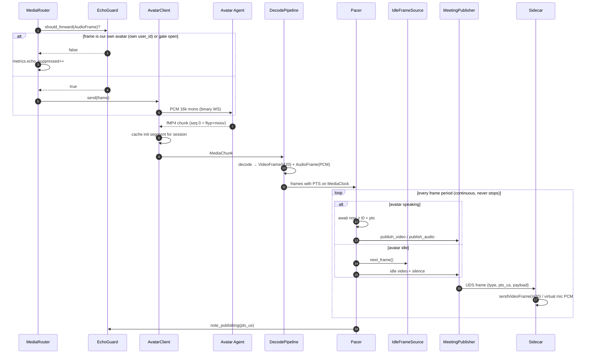
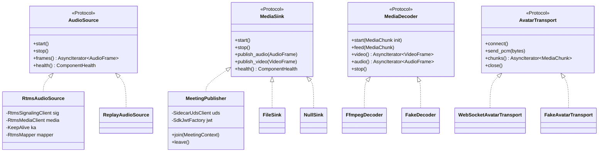
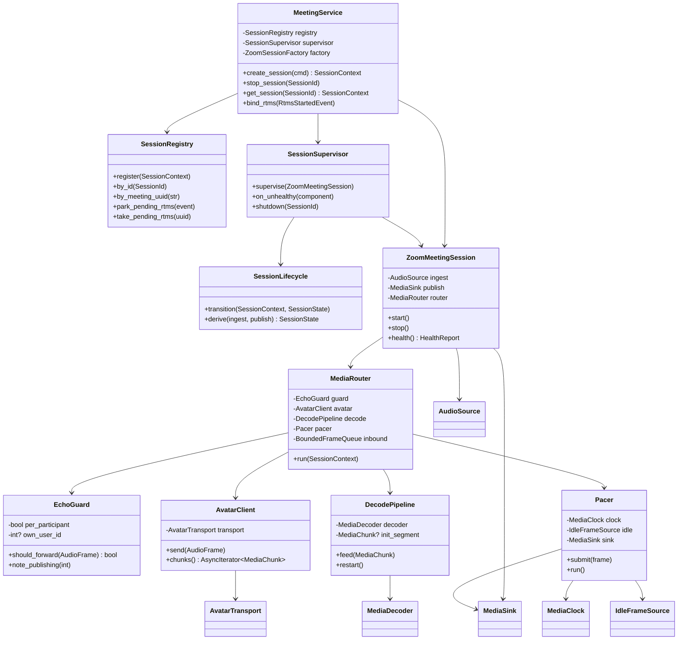
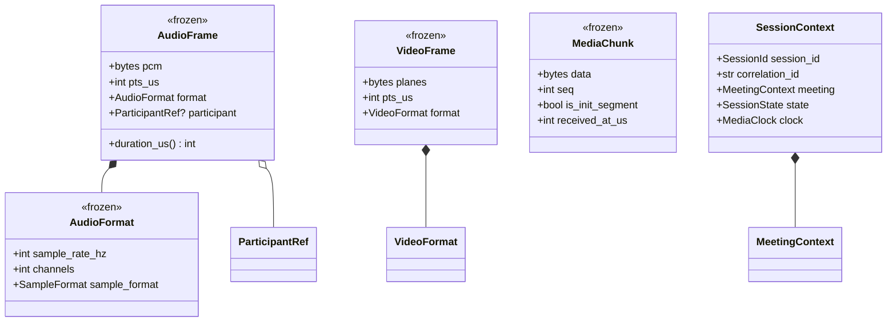
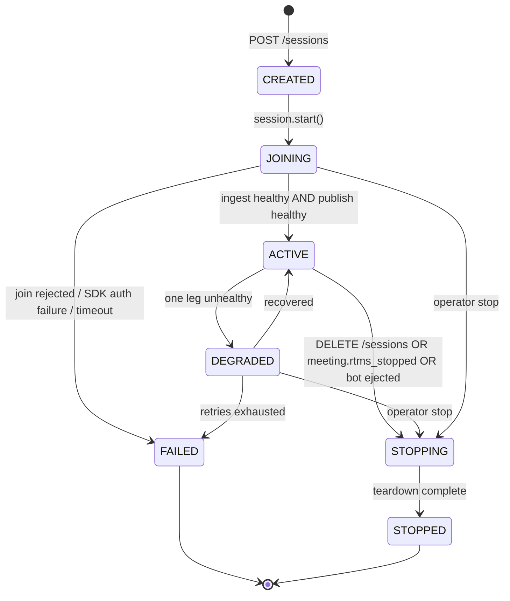
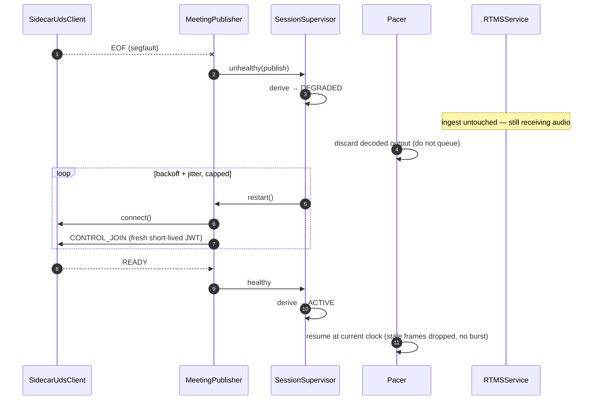

# Meeting Connectors — Zoom V1 Technical Architecture

**Status:** Phase 1 — Architecture. Awaiting approval. No implementation code.
**Supersedes for implementation purposes:** [002](./002-multi-platform-architecture-review.md) (multi-platform review — retained as a *roadmap*, not a build target)
**Builds on:** [001](./001-zoom-avatar-bridge.md) (RTMS/Meeting SDK validation — still authoritative on Zoom mechanics)
**Date:** 2026-08-05
**Scope:** Zoom only. Two participants: one human, one avatar.

---

## 0. The Scope-Down Rule

Doc 002 designed for three platforms. This document deliberately retreats from that. To keep the retreat principled rather than arbitrary, one rule governs every abstraction:

> **A protocol earns its place only if a second implementation exists in this repository today.**
> Everything else is documented as deferred and implemented as a concrete class.

Applied honestly, that leaves **four** protocols — each with a real second implementation needed by the Zoom build itself:

| Protocol | Impl 1 | Impl 2 (why it exists *today*) |
|---|---|---|
| `AudioSource` | `RtmsAudioSource` | `ReplayAudioSource` — run the whole pipeline from a recorded PCM file, no live meeting |
| `AvatarTransport` | `WebSocketAvatarTransport` | `FakeAvatarTransport` — tests without the avatar service |
| `MediaDecoder` | `FfmpegDecoder` | `FakeDecoder` — deterministic frames in tests, no ffmpeg |
| `MediaSink` | `SidecarPublisher` | `FileSink` / `NullSink` — **M4 must produce watchable output before M5 exists** |

That last row is the important one. It is not future-proofing; it is what lets Milestones 1–4 be fully tested with no Zoom SDK build, no C++ toolchain, and no entitlement.

### 0.1 Cut from 002, with reasons

| Cut | Why it doesn't earn its place |
|---|---|
| `MeetingConnector` / `ConnectorSession` / `ConnectorRegistry` / `MeetingUrlResolver` | Registry indirection with one entry. `MeetingService` composes Zoom components directly. |
| `ConnectorCapabilities` | Capability negotiation with one platform is a constant folded into code. |
| `SidecarTransport` (UDS / TCP / in-process) | Teams-driven (Windows). V1 has one transport: **UDS, concrete**. |
| **In-process event bus** | 002 justified it for future analytics/recording subscribers. Today there are none. Metrics are a direct non-blocking in-memory call (~µs); session persistence happens on ~6 lifecycle transitions, not per frame. A pub/sub registry with per-subscriber queues and overflow policies buys nothing and costs a hot-path indirection. **Reversal from 002 — stated plainly.** |
| `SessionRepository` + SQLite | Not requested for V1, and RTMS cannot resume across a restart anyway (001 §10), so a durable session row has no recovery value yet. In-memory `SessionRegistry` only. |
| `PyAvDecoder` | `MediaDecoder` protocol keeps the door open. Ship one decoder. |
| `ReconnectScope` enum | The *behaviour* (independent recovery of ingest vs publish) is kept and is essential. The enum ceremony is not — each component owns its own retry loop and reports health. |
| `teams/`, `google_meet/` packages | Out of scope entirely. Not even stubs. |

### 0.2 Kept from 001/002, because Zoom itself needs them

- **Canonical domain model + anti-corruption boundary** — not multi-platform ceremony. It is what keeps `msg_type` and base64 out of the router, decoder, and pacer, and what makes them unit-testable without RTMS.
- **Shared media clock + pacer** — Zoom's send-audio and send-video are separate paths with documented desync risk (001 §7.1).
- **`EchoGuard`** — the avatar hearing itself is a real Zoom feedback loop (001 §6.3), not a hypothetical.
- **Bounded queues with explicit drop policy** (001 §7.2).
- **C++ sidecar over UDS** (001 §3).
- **Init-segment replay on decoder restart** (002 §3.4).

---

## 1. Technical Architecture

### 1.1 The two Zoom integrations

Confirmed in 001 and unchanged: **RTMS cannot publish media.** Every RTMS message type is inbound media, inbound metadata, or bidirectional *control*. So V1 uses exactly two official Zoom technologies, in strictly separate directions:

| Direction | Technology | Runtime |
|---|---|---|
| **Receive** participant audio + meeting events | Zoom **RTMS** (WebSocket) | Python, in-process |
| **Publish** avatar camera + microphone | Zoom **Meeting SDK for Linux**, raw data send | **C++ sidecar** |

No browser automation, no Playwright/Selenium, no virtual webcams, no unofficial APIs.

### 1.2 Why not receive audio through the Meeting SDK too?

Worth addressing, because it would remove a whole subsystem. The Meeting SDK *can* receive raw audio — so RTMS is arguably redundant, and one integration is simpler than two.

I'm following the mandated split, and it holds up on its own merits:

1. **It keeps the sidecar write-only.** The instruction is that the sidecar has exactly one responsibility. Receiving audio in C++ would mean raw-data callbacks, participant tracking, and buffering in native code — and every one of those is business logic leaving Python.
2. **RTMS delivers exactly the avatar's input format.** `L16 / SR_16K / MONO` is directly selectable in the handshake. **Zero resampling on ingest** (001 §6.1). Meeting SDK raw audio would need conversion.
3. **The legs fail independently.** A sidecar segfault does not interrupt hearing; an RTMS drop does not eject the bot. Merging them couples both to one native process.
4. **Per-participant audio.** `AUDIO_MULTI_STREAMS` is what makes echo suppression structural rather than heuristic (§5.3).

The cost is one extra moving part and one extra credential path. Accepted.

### 1.3 The bridge decides nothing

No AI in scope, so the control logic is deliberately trivial and must stay that way:

- Participant audio is forwarded to the avatar **continuously**. The bridge never runs VAD, never decides when to speak, never buffers an utterance.
- When the avatar streams fMP4, we decode, pace, and publish it.
- When the avatar streams nothing, we publish **idle media** (§1.4).

Every "should the avatar respond?" question lives inside the avatar agent, which we do not touch.

### 1.4 Idle media — required for "looks like a human"

**A gap not covered in 001 or 002.** Zoom's external video source must be fed continuously at the negotiated frame rate. If we only push frames while the avatar speaks, then between utterances the camera freezes on the last frame or drops out — which reads as a broken connection, not a person.

So the publisher is always sending, and the pacer draws from one of two sources:

| Avatar state | Video | Audio |
|---|---|---|
| Speaking | decoded fMP4 frames | decoded PCM |
| Idle | `IdleFrameSource` — looping idle clip, or last frame held | digital silence at frame cadence |

Transitions between the two are made on frame boundaries by the pacer, so `av_skew` and cadence are unaffected. Without this the end goal — indistinguishable from a human participant — is not met.

### 1.5 Layering

```
api/           HTTP edge. FastAPI. No media, no SDK types.
services/      Orchestration + media pipeline. Depends on protocols/ + domain/.
connectors/    Zoom adapters. The ONLY place RTMS wire types or SDK concepts appear.
avatar/        Fixed avatar contract. Knows nothing about Zoom.
domain/        Canonical models. Depends on nothing.
protocols/     Four ports (§0).
infrastructure/ Logging, metrics, process supervision, clock.
```

**Hard invariant:** RTMS wire models (`msg_type`, `rtms_stream_id`, base64 envelopes) never leave `connectors/zoom/rtms/`. Translation happens in `mapping.py`. Enforced by a test that walks the import graph (§7.6).

---

## 2. Component Diagram



Note the asymmetry, which is the whole architecture in one picture: **audio comes in over a Python WebSocket; media goes out through a C++ process.** They meet only in `services/media/`.

---

## 3. Sequence Diagrams

### 3.1 Session creation and the join/RTMS race

A real-world ordering problem neither prior doc addressed: we initiate the bot join, but **Zoom initiates RTMS** via webhook. Those two events can arrive in either order.



Because the publisher comes up independently, **the avatar is visible and idling in the meeting before it can hear anything.** That is the correct behaviour — a participant who has joined but not yet spoken.

### 3.2 RTMS attach (Zoom protocol, fully encapsulated)



`send_rate: 20` not the sample default of `100` — 80 ms of latency reclaimed at the first hop (001 §6.1). `msg_type` appears nowhere right of `mapping.py`.

### 3.3 Media round trip — human speaks, avatar answers



`note_publishing` arming the echo gate closes the feedback loop (001 §6.3 layer 2). The pacer loop **never stops** for the session's lifetime — that is §1.4 made concrete.

---

## 4. Folder Structure

Follows the requested layout. Two deviations, noted below.

```
meeting-connectors/
├── src/
│   ├── api/
│   │   ├── app.py                     # FastAPI factory
│   │   ├── dependencies.py
│   │   ├── dto.py                     # CreateSessionRequest / SessionResponse
│   │   └── routers/
│   │       ├── sessions.py            # POST /sessions · DELETE /sessions/{id} · GET
│   │       ├── health.py
│   │       └── metrics.py
│   │
│   ├── config/
│   │   └── settings.py                # Settings · ZoomSettings · AvatarSettings ·
│   │                                  #   MediaSettings · SidecarSettings (pydantic-settings)
│   │
│   ├── domain/                        # depends on NOTHING
│   │   ├── media.py                   # AudioFrame · VideoFrame · MediaChunk ·
│   │   │                              #   AudioFormat · VideoFormat · PixelFormat
│   │   ├── meeting.py                 # MeetingContext · ParticipantRef
│   │   ├── session.py                 # SessionId · SessionContext · SessionState · SessionError
│   │   ├── avatar.py                  # AVATAR_INPUT_FORMAT · AVATAR_OUTPUT_CONTAINER
│   │   └── health.py                  # HealthReport · ComponentHealth · ComponentState
│   │
│   ├── protocols/                     # exactly four ports (§0)
│   │   ├── audio_source.py            # AudioSource
│   │   ├── avatar.py                  # AvatarTransport
│   │   ├── decoder.py                 # MediaDecoder
│   │   └── sink.py                    # MediaSink
│   │
│   ├── services/
│   │   ├── meeting/
│   │   │   └── service.py             # MeetingService
│   │   ├── session/
│   │   │   ├── registry.py            # SessionRegistry (in-memory) + PendingRtmsBinding
│   │   │   ├── lifecycle.py           # state machine + legal transitions
│   │   │   └── supervisor.py          # SessionSupervisor: TaskGroup, health, restart, cleanup
│   │   └── media/
│   │       ├── router.py              # MediaRouter
│   │       ├── echo_guard.py          # EchoGuard
│   │       ├── decode_pipeline.py     # DecodePipeline (owns decoder lifecycle + init replay)
│   │       ├── pacer.py               # Pacer
│   │       ├── clock.py               # MediaClock
│   │       ├── idle_source.py         # IdleFrameSource
│   │       ├── queues.py              # BoundedFrameQueue · OverflowPolicy
│   │       └── decoders/
│   │           ├── ffmpeg.py          # FfmpegDecoder
│   │           └── factory.py
│   │
│   ├── connectors/zoom/               # ONLY place Zoom concepts exist
│   │   ├── rtms/
│   │   │   ├── service.py             # RTMSService (facade: signaling + media)
│   │   │   ├── signaling.py           # signaling WS
│   │   │   ├── media_ws.py            # media WS
│   │   │   ├── keepalive.py           # msg 12/13 — protocol-local (001 D6 fix)
│   │   │   ├── models.py              # wire models. NEVER leave this package.
│   │   │   ├── mapping.py             # wire → domain. THE anti-corruption boundary.
│   │   │   ├── enums.py               # msg types, sample rates, data_opt
│   │   │   └── audio_source.py        # RtmsAudioSource (implements AudioSource)
│   │   ├── publisher/
│   │   │   ├── publisher.py           # MeetingPublisher (implements MediaSink)
│   │   │   ├── uds_client.py          # framing + connect + reconnect
│   │   │   ├── protocol.py            # wire format (§7.4)
│   │   │   └── sidecar/               # C++ — the only non-Python code
│   │   │       ├── CMakeLists.txt
│   │   │       └── src/               # main · uds_server · video_source · virtual_mic
│   │   ├── auth/
│   │   │   ├── webhook_verifier.py    # x-zm-signature + url_validation challenge
│   │   │   ├── rtms_signature.py      # HMAC(client_id,uuid,stream_id)
│   │   │   └── sdk_jwt.py             # Meeting SDK JWT
│   │   ├── webhook/
│   │   │   ├── router.py              # /webhooks/zoom
│   │   │   └── events.py              # rtms_started / rtms_stopped models
│   │   ├── session/
│   │   │   └── zoom_session.py        # ZoomMeetingSession: composes RTMS + publisher
│   │   ├── config.py
│   │   └── exceptions.py
│   │
│   ├── avatar/
│   │   ├── client.py                  # AvatarClient
│   │   ├── ws_transport.py            # WebSocketAvatarTransport (reconnect, backpressure)
│   │   └── framing.py                 # fMP4 chunk assembly + init-segment detection
│   │
│   ├── infrastructure/
│   │   ├── logging.py                 # structlog + correlation id
│   │   ├── metrics.py                 # MetricsCollector (in-memory histograms)
│   │   └── process.py                 # async subprocess supervision (ffmpeg, sidecar)
│   │
│   └── containers.py                  # Dependency Injector — only module knowing concrete types
│
├── tests/
│   ├── unit/
│   ├── integration/
│   ├── architecture/                  # import-graph invariants (§7.6)
│   └── fakes/                         # FakeAvatarTransport · FakeDecoder · ReplayAudioSource
│
├── docker/
│   ├── Dockerfile                     # python:3.12-slim + ffmpeg
│   ├── Dockerfile.sidecar             # C++ build + Meeting SDK runtime deps
│   └── docker-compose.yml             # bridge + sidecar (shared UDS volume) + mock-avatar
│
├── docs/design/
├── pyproject.toml
└── README.md
```

**Deviations from the requested structure**

1. **`tests/` at repo root, not `src/tests/`.** Tests inside the package would ship in the built wheel and let production code import test fakes. Standard Python packaging practice.
2. **`services/media/` holds the pipeline; decoders nested under it.** Matches the requested `services/media/` while keeping decoder implementations separable.

---

## 5. Class Diagram

### 5.1 Ports and the Zoom implementations



### 5.2 Services and pipeline



### 5.3 Canonical domain model



`AVATAR_INPUT_FORMAT = AudioFormat(16_000, 1, S16LE)` is a domain constant. RTMS is configured to match it, so the ingest path asserts equality rather than resampling — the zero-resample property becomes checkable instead of incidental.

---

## 6. Session Lifecycle

### 6.1 States

| State | Meaning |
|---|---|
| `CREATED` | Registered. Nothing started. |
| `JOINING` | Publisher joining and/or RTMS not yet attached. |
| `ACTIVE` | Ingest streaming **and** publisher ready. Avatar can hear and speak. |
| `DEGRADED` | Exactly one leg unhealthy; recovery in progress. |
| `STOPPING` | Ordered teardown. |
| `STOPPED` | Terminal, clean. |
| `FAILED` | Terminal, recovery exhausted or unrecoverable. |

### 6.2 State machine



State is **derived**, not assigned ad hoc: `SessionLifecycle.derive(ingest_health, publish_health)`. One function decides, so there is exactly one place where "what does healthy mean" lives.

### 6.3 Notable properties

- **`JOINING → ACTIVE` needs both legs, but the publisher does not wait for ingest.** The avatar joins, appears, and idles while RTMS is still attaching (§3.1).
- **`DEGRADED` with publish healthy / ingest down** — avatar keeps publishing idle media. It looks present but stops responding. Correct: better than vanishing.
- **`DEGRADED` with ingest healthy / publish down** — we keep consuming and forwarding audio to the avatar but discard its output rather than queueing it. Queueing during an outage would make the avatar reply to something said 30 seconds ago.
- **Teardown order is fixed and idempotent:** publisher (leave meeting) → avatar (close WS) → RTMS (close both sockets) → decoder → registry eviction. Publisher first so the participant disappears promptly rather than lingering as a frozen tile.

---

## 7. Failure Recovery Strategy

### 7.1 Matrix

| Failure | Detection | Recovery | Session state |
|---|---|---|---|
| RTMS signaling drop | WS close / keep-alive timeout | Reconnect, backoff + full jitter. **RTMS cannot resume** — gap logged with duration; audio in the gap is permanently lost. | `DEGRADED` |
| RTMS media drop | WS close | Re-handshake media socket; keep signaling if healthy | `DEGRADED` |
| Missed `msg_type 12` | No `13` sent inside window | Watchdog treats as fatal → forced reconnect (Zoom will drop us anyway) | `DEGRADED` |
| Avatar WS drop | close / ping timeout | Reconnect with backoff. Pacer switches to idle source — **no frozen frame** | `DEGRADED` |
| Avatar backpressure | send queue high-water | Drop oldest audio, count it, warn. **Never block the RTMS reader** — blocking there causes Zoom-side loss | `ACTIVE` |
| Decoder crash / bad fragment | subprocess exit / stderr | Restart decoder, **replay cached init segment**, hold idle until first keyframe | `ACTIVE` |
| Sidecar segfault | UDS EOF / process exit | Supervisor restarts, re-issues `CONTROL_JOIN` with fresh JWT. **Ingest unaffected** | `DEGRADED` |
| Sidecar UDS backpressure | write buffer full | Drop video frames (keep audio — voice matters more than smoothness) | `ACTIVE` |
| Bot ejected / meeting ended | SDK callback | Clean teardown, no reconnect storm | `STOPPING` |
| `meeting.rtms_stopped` | webhook | Ordered shutdown per §6.3 | `STOPPING` |
| `HasRawdataLicense()` false | sidecar startup probe | **Fail fast and loudly** at join, not silently at frame 1 | `FAILED` |

### 7.2 Cross-cutting rules

- Exponential backoff with **full jitter**, capped attempt count, then `FAILED` with a structured reason.
- **Never block the ingest reader.** Every downstream queue is bounded with a drop policy; drops are counted, never silent.
- Per-session `asyncio.TaskGroup` — one session's failure cannot touch another.
- Teardown is idempotent; every resource released exactly once.
- No bare `except:`. Every handler logs with the session correlation id.

### 7.3 Recovery sequence — sidecar crash



### 7.4 Sidecar IPC wire format

Length-prefixed binary. No JSON or base64 on the media path.

```
┌────────┬──────┬──────────┬────────┬─────────┐
│ magic  │ type │ pts_us   │ length │ payload │
│ u32    │ u8   │ i64      │ u32    │ bytes   │
└────────┴──────┴──────────┴────────┴─────────┘

type: 1=VIDEO_I420  2=AUDIO_PCM  3=CONTROL_JOIN  4=CONTROL_LEAVE
      5=HEARTBEAT   6=READY      7=ERROR
```

`pts_us` rides the shared `MediaClock`, which is what makes A/V sync possible at the SDK boundary. Secrets live only in Python; the sidecar receives a short-lived JWT in `CONTROL_JOIN` and holds no long-lived credential.

### 7.5 Latency budget

Carried from 001 §9; bridge-controlled hops marked ●.

| Hop | Expected |
|---|---|
| Zoom capture → RTMS socket | 100–300 ms |
| ● `send_rate` framing | 20 ms |
| ● Router + echo guard | < 2 ms |
| ● Bridge → avatar WS | 2–20 ms |
| Avatar processing (not ours) | 200–800 ms |
| ● fMP4 demux, first fragment | 20–60 ms |
| ● Pacer | 0–40 ms |
| ● UDS → sidecar | < 2 ms |
| Meeting SDK encode + upload | 100–200 ms |
| Zoom distribution | 100–200 ms |
| **Total** | **≈ 550 ms – 1.65 s** |
| **Bridge-attributable** | **≈ 45–125 ms** |

M6 replaces this table with measurements. `MetricsCollector` records per-hop histograms plus `av_skew_us` — the direct observable for whether the shared clock is actually working.

### 7.6 Architecture tests

Layering guarded by intention decays, so it becomes executable in `tests/architecture/`:

```
domain/       imports nothing from src/
protocols/    imports only domain/
api/          must not import connectors/
services/     must not import connectors/
avatar/       must not import connectors/
connectors/zoom/rtms/models.py  imported only within connectors/zoom/rtms/
```

A PR that imports RTMS wire models into `services/media/` fails CI with a named rule.

---

## 8. Milestone Plan

Each milestone is fully tested before the next begins. **M1–M4 require no Zoom SDK build, no C++ toolchain, and no entitlement** — four of six milestones are provable while the native dependency is still being sorted.

### M1 — Project skeleton
Poetry, Ruff, pytest, Docker + Compose, `config/`, `domain/`, `protocols/`, `infrastructure/` (structlog + metrics), DI container, FastAPI `/health`.
**Exit:** container boots, `/health` green, `ruff check` clean, `pytest` green, architecture tests enforcing §7.6 already passing.

### M2 — RTMS: receive audio
Webhook verification (signature + url_validation challenge), RTMS signature, signaling + media handshake, keep-alive, `msg 14` → `mapping.py` → `domain.AudioFrame`, `RtmsAudioSource`, `MeetingService` + `SessionRegistry` + join/RTMS race binding.
**Tests:** unit on signature/verifier/mapping/enums; integration against a fake RTMS server driving the real handshake and keep-alive; assert ingest format equals `AVATAR_INPUT_FORMAT`.
**Exit:** live audio from a real Zoom meeting, frame counts and per-frame timing logged. **PoC goal 1 proven.**

### M3 — Avatar client
`WebSocketAvatarTransport` (reconnect, backpressure, bounded send queue), `AvatarClient`, fMP4 framing with init-segment detection and caching, `MediaRouter` + `EchoGuard`. Mock avatar server in `tests/fakes/`.
**Tests:** backpressure drops oldest and counts; reconnect preserves session; echo guard filters own `user_id` and honours the gate + hangover; init segment cached exactly once.
**Exit:** PCM forwarded continuously; fMP4 received as a stream. **Goal 2 proven.**

### M4 — Media decoder + synchronized frames
`FfmpegDecoder`, `DecodePipeline` (restart + init replay), `MediaClock`, `Pacer`, `IdleFrameSource`, `FileSink`.
**Tests:** decode a known fMP4 fixture → expected frame count/dimensions; PTS monotonic and rebased; pacer drops late frames instead of bursting; decoder restart replays init segment; idle↔speaking transitions preserve cadence.
**Exit:** `FileSink` produces a playable MP4 of the avatar's response with correct A/V sync. **Goals 3 & 4 proven — watchable, no Zoom SDK involved.**

### M5 — Meeting SDK publisher
C++ sidecar: UDS server, `IZoomSDKVideoSource` + `IZoomSDKVideoSender`, virtual microphone via `setExternalAudioSource`, `HasRawdataLicense()` probe. Python `MeetingPublisher` + `SidecarUdsClient` + `sdk_jwt.py`. `Dockerfile.sidecar`.
**Tests:** IPC framing round-trip; JWT claims; reconnect on sidecar restart; manual verification that the avatar joins, appears, and is audible.
**Exit:** avatar joins as a participant, publishes video and audio. **Goal 5 proven.**

### M6 — End-to-end
Full loop: human speaks → RTMS → avatar → fMP4 → decode → publish. Per-hop latency histograms, `av_skew_us`, chaos tests against every §7.1 row.
**Exit:** two participants in a Zoom meeting — one human, one avatar that hears, answers, is seen and heard, and leaves cleanly. Measured latency table replacing §7.5. **Goal 6 answered with numbers.**

---

## 9. Open Questions

Two carried from 001, acknowledged as being handled on the agent side:

- **A1 — fMP4 required.** A plain MP4 puts `moov` at the end and cannot be decoded until the avatar stops speaking. The stream must be `ftyp+moov` followed by independently decodable `moof+mdat` fragments. Confirmed as fixed in the avatar contract.
- **A3 — real Zoom Meetings**, not Video SDK sessions. Assumed; drives the Meeting SDK choice.

New for V1:

| # | Question | Default if unanswered |
|---|---|---|
| Q1 | **Avatar WS framing** — how is end-of-utterance signalled, and is `seq 0` always the init segment on reconnect? | Assume binary frames, `seq 0` = init segment, silence = idle. `framing.py` isolates this so it is a one-file change. |
| Q2 | **Idle video content** — looping idle clip, or hold last frame? | Hold last frame for M4; add a configurable idle clip path in M5. |
| Q3 | **RTMS start mechanism** — auto-start on the app, or started per meeting via API/JS SDK? | Assume auto-start so `meeting.rtms_started` fires on meeting start. Affects M2 test setup only. |
| Q4 | Virtual-mic sample rate the Meeting SDK expects | Read from SDK headers in M5; a config value until then, not a hardcoded constant. |
| Q5 | Publish resolution / fps the account permits (`support_cap_list`) | Probe at sidecar init; negotiate down. |

---

## 10. Approval Gate

| # | Decision | Recommendation |
|---|---|---|
| 1 | Scope-down rule: a protocol needs a second implementation today (§0) — four ports only | ✅ Direct answer to "do not over-engineer" |
| 2 | Cut event bus, connector registry, capabilities, SQLite, `SidecarTransport` (§0.1) | ✅ Recommended — reversal from 002, stated plainly |
| 3 | Keep canonical domain model + anti-corruption boundary, CI-enforced | ✅ Recommended — Zoom needs it for testability, not for future platforms |
| 4 | **`IdleFrameSource` — publish continuously, idle when silent (§1.4)** | ✅ **New. Required for the end goal**; a frozen tile does not read as human |
| 5 | Publisher joins independently of RTMS; avatar visible before it can hear (§3.1, §6.3) | ✅ Recommended |
| 6 | Handle the join/RTMS webhook race in both orders via `PendingRtmsBinding` (§3.1) | ✅ Recommended |
| 7 | On publish outage, discard avatar output rather than queueing it (§6.3) | ✅ Recommended — stale replies are worse than silence |
| 8 | `tests/` at repo root rather than `src/tests/` (§4) | ✅ Recommended — packaging hygiene |
| 9 | Ship `FfmpegDecoder` only; PyAV documented, not built | ✅ Recommended |

On approval I'll implement **M1 only**, run lint and tests, and stop for review before M2.

---

## References

- [RTMS overview](https://developers.zoom.us/docs/rtms/) · [getting started](https://developers.zoom.us/docs/rtms/meetings/getting-started/) · [data types](https://developers.zoom.us/docs/rtms/data-types/)
- [zoom/rtms](https://github.com/zoom/rtms) · [zoom/rtms-samples — protocol flow](https://github.com/zoom/rtms-samples)
- [Zoom Meeting SDK for Linux](https://developers.zoom.us/docs/meeting-sdk/linux/) · [raw recording sample](https://github.com/zoom/meetingsdk-linux-raw-recording-sample)
- [What is Zoom RTMS? — receive-only](https://www.recall.ai/blog/what-is-zoom-rtms) · [streaming video into a meeting](https://www.recall.ai/blog/zoom-sdk-streaming-video-to-meeting)
- [Devforum: send/receive A/V sync](https://devforum.zoom.us/t/syncing-send-video-and-send-audio-in-meeting-sdk/110080) · [raw data entitlement](https://devforum.zoom.us/t/request-to-enable-meeting-sdk-raw-data-entitlement-sending-external-video-audio/144868)
